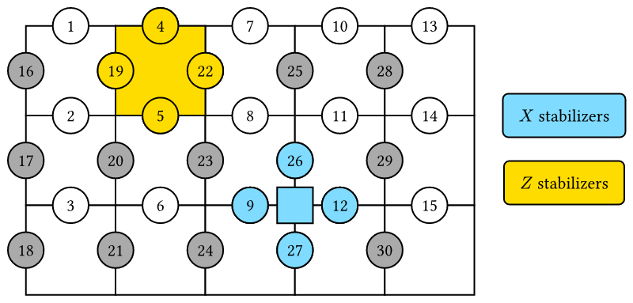
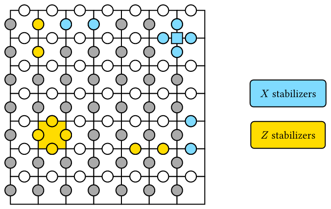
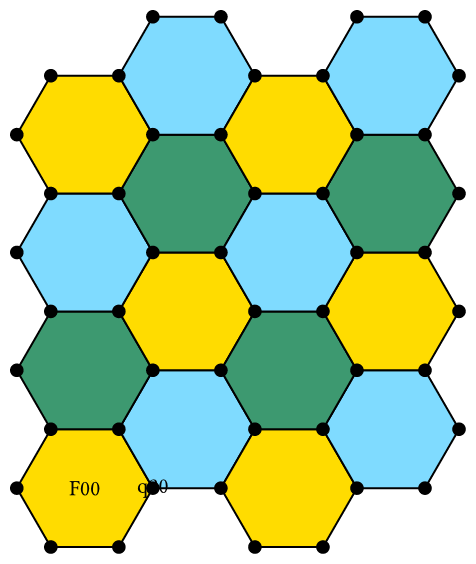
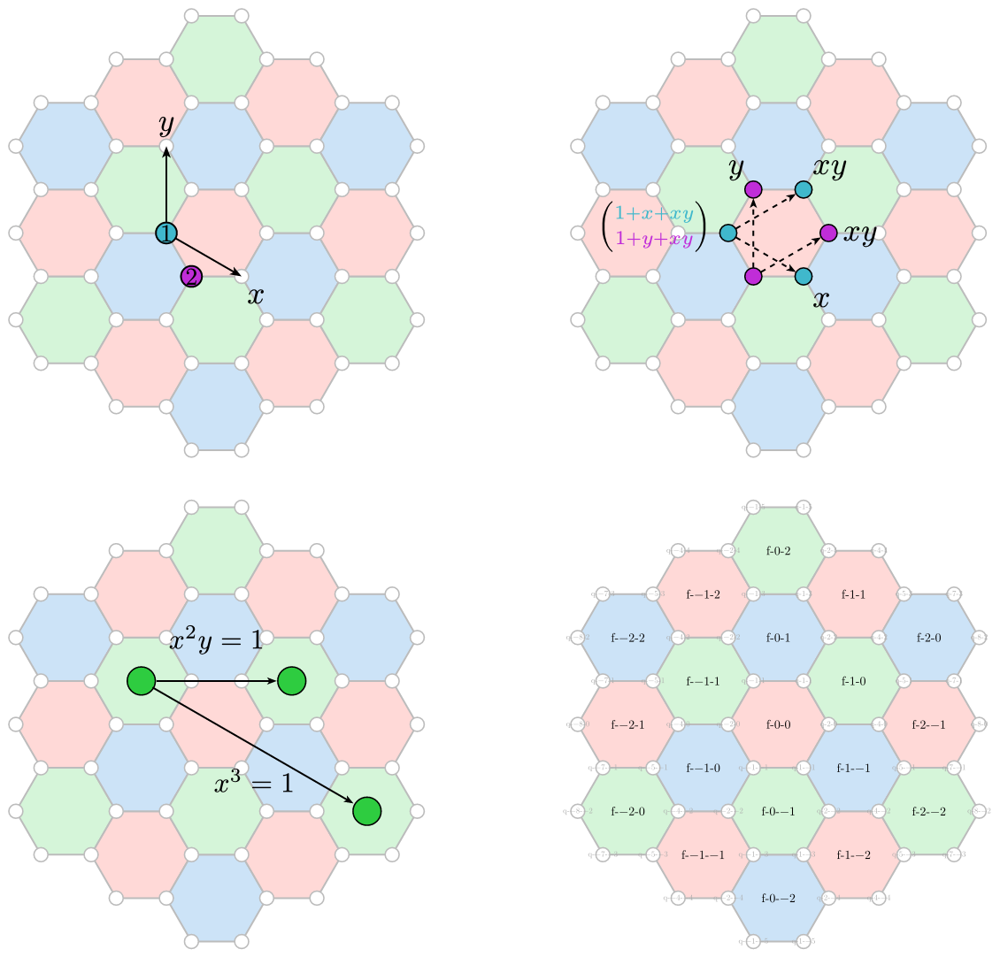
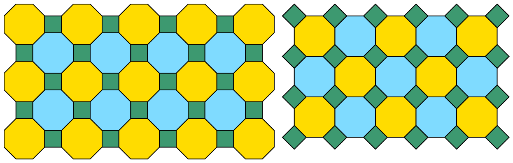
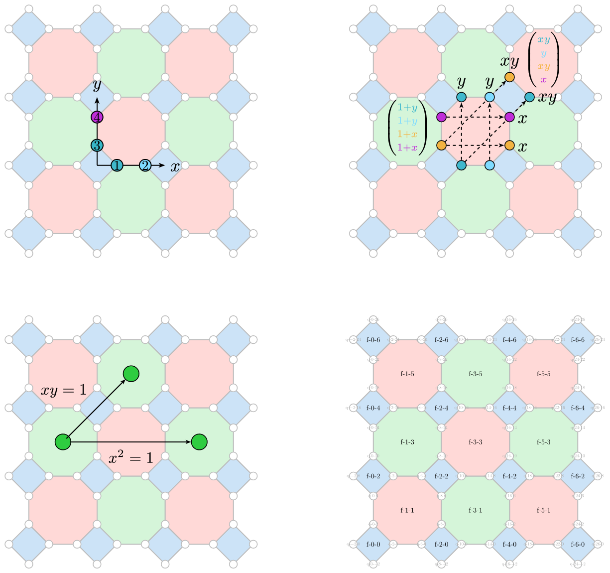
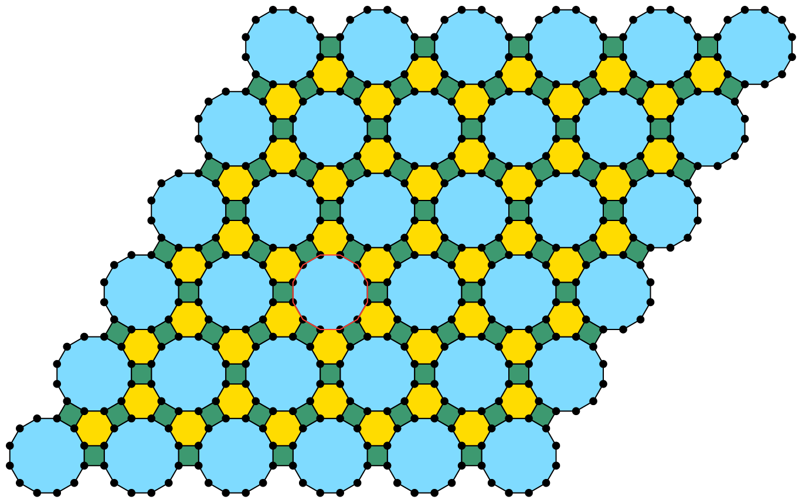

# Visualization of Quantum Error Correction Codes
This is a Typst package for visualizing quantum error correction codes.

**Note: Requires CeTZ version >= 0.4.0 and compiler version >= 0.13**


## Steane code
You can draw a Steane code by calling the `steane-code` function. The name of the qubits are automatically generated as `steane-1`, `steane-2`, etc.
```typ
#import "@preview/qec-thrust:0.2.0": *

#canvas({
  import draw: *
  steane-code((0, 0), size: 3)
    for j in range(7) {
      content((rel: (0, -0.3), to: "steane-" + str(j+1)), [#(j)])
    }
})
```


## Surface code
You can draw a surface code with different size, color and orientation by `surface-code` function. The name of the qubits can be defined with `name` parameter as `name-i-j`. By default, they will be named as `surface-i-j`. The `type-tag` parameter can be set to `false` to change the orientation of the surface code. You can also tweak `point-radius` (relative to `size`) and `boundary-bulge` for the boundary curves. Here is an example of two surface codes.
```typ
#canvas({
  import draw: *
  let n = 3
  surface-code((0, 0),size:1.5, n, n,name: "surface1")
  for i in range(n) {
    for j in range(n) {
      content((rel: (0.3, 0.3), to: "surface1" + "-" + str(i) + "-" + str(j)), [#(i*n+j+1)])
    }
  }
  surface-code((4, 0), 15, 7,color1:red,color2:green,size:0.5,type-tag: false)
  })
```


## Toric code
`toric-code(...)` now returns a reusable object API. Build the object first, call `code.draw-background()`, then annotate through stable helpers.

- `code.qubits`: qubit records with stable ids `("vertical", i, j)` and `("horizontal", i, j)`.
- `code.plaquettes`: plaquette stabilizer records with stable zero-based cell ids `("plaquette", i, j)`.
- `code.vertices`: vertex stabilizer records with stable zero-based vertex ids `("vertex", i, j)`.
- `code.qubit-anchor(id)`, `code.plaquette-anchor(id)`, `code.vertex-anchor(id)`: anchor helpers.
- `code.highlight-qubit(id, ...)`, `code.highlight-plaquette(id, ...)`, `code.highlight-vertex(id, ...)`: stabilizer/qubit emphasis helpers.
- `code.highlight-plaquette(..., selected-qubits: (...))` and `code.highlight-vertex(..., selected-qubits: (...))`: override the default support when you want to draw custom BB-code-style operators.

Here is a 5x3 toric example:
```typ
#canvas({
  import draw: *
  let m = 5
  let n = 3
  let size = 2
  let circle-radius = 0.4
  let code = toric-code((0, 0), m, n, size: size, circle-radius: circle-radius)
  (code.draw-background)()
  (code.highlight-plaquette)((1, 0))
  (code.highlight-vertex)((3, 2))
  stabilizer-label((12, -2))
  for i in range(m){
    for j in range(n){
      content((code.qubit-anchor)(("vertical", i, j)), [#(i*n+j+1)])
      content((code.qubit-anchor)(("horizontal", i, j)), [#(i*n+j+1+m*n)])
    }
  }
})
```


Here is the $〚98,8,12〛$ BB-code style annotation migrated to object helpers:

```typ
#canvas({
  import draw: *
  let code = toric-code((0, 0), 7, 7, size: 1)
  (code.draw-background)()
  (code.highlight-plaquette)(
    (1, 4),
    selected-qubits: (
      ("vertical", 1, 4),
      ("vertical", 1, 5),
      ("horizontal", 2, 4),
      ("horizontal", 1, 4),
      ("vertical", 4, 5),
      ("vertical", 5, 5),
      ("horizontal", 1, 0),
      ("horizontal", 1, 1),
    ),
  )
  (code.highlight-vertex)(
    (6, 1),
    selected-qubits: (
      ("vertical", 5, 1),
      ("vertical", 6, 1),
      ("horizontal", 6, 1),
      ("horizontal", 6, 0),
      ("vertical", 6, 5),
      ("vertical", 6, 4),
      ("horizontal", 2, 0),
      ("horizontal", 3, 0),
    ),
  )
  stabilizer-label((10, -3))
})
```


## 2D color code
`color-code-2d` now returns a geometry object instead of drawing directly. This is a breaking change in `0.2.x`: construct the patch first, then draw and annotate it explicitly inside `canvas`.

```typ
#canvas({
  import draw: *

  let code = color-code-2d(
    (0, 0),
    tiling: "6.6.6",
    shape: "rect",
    size: (rows: 4, cols: 4),
    hex-orientation: "flat",
    scale: 1.0,
    color1: yellow,
    color2: aqua,
    color3: olive,
    name: "color-rect",
    show-qubits: true,
    qubit-radius: 0.08,
  )

  (code.draw-background)()
  (code.highlight-face)((0, 0), stroke: (paint: red, thickness: 1pt))
  (code.highlight-qubit)((2, 0), stroke: (paint: blue, thickness: 1pt))
  content((code.face-anchor)((0, 0)), [f])
  content((code.qubit-anchor)((2, 0)), [q])
})
```

The returned object exposes:

- `code.faces`: canonical face records with `id`, `kind`, `color`, `center`, `vertices`, `qubits`, and `meta`.
- `code.qubits`: canonical qubit records with `id`, `pos`, `incident-faces`, `boundary-tags`, and `meta`.
- `code.boundaries`: boundary-indexed qubit ids. For `6.6.6` hex patches this includes `x+`, `y+`, `z+`, `x-`, `y-`, and `z-`.
- `code.basis`: lattice basis information. `4.8.8` and `4.6.12` expose `origin`, `x`, and `y`; `6.6.6` exposes orientation metadata.
- `code.face-anchor(id)` and `code.qubit-anchor(id)`: stable anchors for downstream figure composition.
- `code.draw-background()`, `code.highlight-face(id, ..style)`, and `code.highlight-qubit(id, ..style)`: the small official drawing helper surface.

For `tiling: "6.6.6"`, supported shapes are `rect`, `para`, `tri`, `tri-cut`, and `hex`. `hex-orientation` can be `"flat"` or `"pointy"` for the non-hex patches (`tri-cut` requires `"flat"`). Tuple shorthand such as `(0, 0)` for faces and `(2, 0)` for qubits is accepted for the simple `6.6.6` and `4.8.8` id schemes.

The bundled `examples/color_code_666.typ` now shows the supported `6.6.6` boundary shapes and orientations without annotations, while `examples/color_code_666_panels.typ` composes the object API into a four-panel figure with basis, stabilizer, anyon, and label views.




## 2D color code (4.8.8)
`tiling: "4.8.8"` now uses the same object API, keeps `size: (rows: ..., cols: ...)` as a rectangular patch boundary, and exposes a geometry-derived 45-degree reading frame through `code.basis.origin`, `code.basis.x`, and `code.basis.y`.

```typ
#canvas({
  let code = color-code-2d(
    (0, 0),
    tiling: "4.8.8",
    shape: "rect",
    size: (rows: 4, cols: 4),
    scale: 0.8,
    color1: yellow,
    color2: aqua,
    color3: olive,
    name: "color-488",
    show-qubits: true,
    qubit-radius: 0.1,
  )
  (code.draw-background)()
})
```

The bundled `examples/color_code_488.typ` now shows the same rectangular `4.8.8` patch under several viewing rotations, and `examples/color_code_488_panels.typ` composes the basis, stabilizer, anyon, and label panels on one canvas.




## 2D color code (4.6.12)
`tiling: "4.6.12"` also returns the shared object shape. Currently only `shape: "rect"` is implemented. Stable face ids use the canonical prefixes `f-dod-*`, `f-sq-*`, and `f-hex-*`.

```typ
#canvas({
  import draw: content

  let code = color-code-2d(
    (0, 0),
    tiling: "4.6.12",
    shape: "rect",
    size: (rows: 6, cols: 6),
    scale: 0.6,
    color1: yellow,
    color2: aqua,
    color3: olive,
    name: "color-4612",
    show-qubits: true,
    qubit-radius: 0.2,
  )

  (code.draw-background)()
  (code.highlight-face)("dod-2-2", stroke: (paint: red, thickness: 1pt))
  content((code.face-anchor)("dod-2-2"), [dod])
})
```



## Notes
- If you draw multiple codes of the same type in one canvas, set a unique `name` prefix to avoid anchor collisions.
- `show-qubits`, `qubit-radius`, `qubit-color`, `show-stabilizers`, and `stabilizer-offset` are constructor options that affect `code.draw-background()`.
- `surface-code` uses +y upward, while `toric-code` uses -y downward (grid grows down).
## License

Licensed under the [MIT License](LICENSE).
